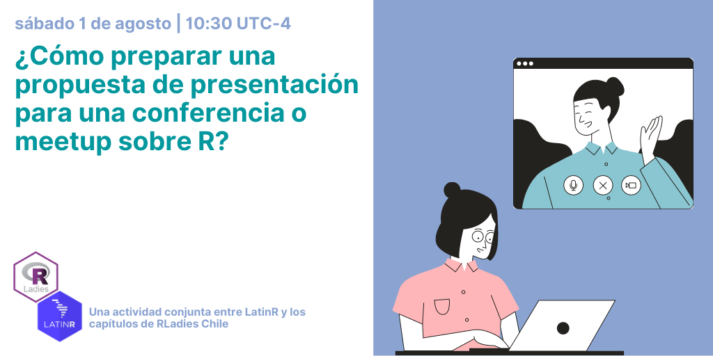

# ¿Cómo preparar una propuesta de presentación para una conferencia/meetup sobre R? 

La realización de conferencias y meetups sobre R en modalidad virtual es una excelente oportunidad para que grupos menos representados en nuestra comunidad participen en estas instancias. Para muchas personas la imposibilidad de viajar --sea por la razón que sea-- ha sido un impedimento para poder ser parte de estas actividades. Ahora tenemos una oportunidad que es importante que aprovochemos. Pero ¿cómo preparar una propuesta? ¿Qué debiese incluir el abstract? ¿Para qué conferencia es más apropiada la idea que tengo? ¿Qué debería tener en cuenta al pensar una propuesta de presentación para un meetup? ¿Es lo mismo escribir un abstract para una conferencia de R que para una conferencia en mi disciplina? ¿Qué tengo que incluir en la Bio? Para responder estas preguntas y compartir algunas recomendaciones para diseñar tu propuesta nos juntaremos el próximo sábado 1 de agosto :)

### ¿Cómo me inscribo?

Desde cualquiera de los grupos de Meetup de los capítulos activos de RLadies Chile:

- [RLadies Santiago](https://www.meetup.com/es/rladies-scl/events/272107368/)
- [RLadies Valparaíso](https://www.meetup.com/es/rladies-valparaiso/events/272089894/)
- [RLadies Concepción](https://www.meetup.com/es/rladies-concepcion/events/272114170/)

### ¿Y si todavía no tengo una idea para una presentación?

No importa. Durante la sesión hablaremos también sobre cómo generar ideas. Además, para el caso de algunas conferencias hay tiempo todavía. Quizás ahora mismo no se te ocurre nada en particular, pero puedes empezar a planear un proyecto para presentar en alguno de los eventos del próximo año.

### ¿Qué necesito para participar?

Lo primero, [es leer nuestro código de conducta](https://github.com/rladies/starter-kit/wiki/Code-of-Conduct#spanish). Es requisito para asistir estar de acuerdo con él. Queremos que nuestros meetups sean un espacio seguro y amable en que todas las personas se sientan cómodas participando.

Lo segundo, es asegurarte de que puedes utilizar la aplicación Zoom en tu computador. El día del taller te enviaremos el enlace para unirte (chequea ese día que el mensaje no se haya ido a la carpeta de spam). Usualmente compartimos el enlace 30 minutos antes de la sesión.

### ¿Hay algo más que deba saber sobre este evento?

Esta es una actividad organizada por los capítulos de RLadies de Chile en conjunto con [LatinR](https://latin-r.com/), la Conferencia Latinoamericana sobre Uso de R en Investigación + Desarrollo. Queremos más representación de Latinoamérica en las conferencias de R alrededor del mundo y qué mejor que apoyarnos como comunidad para lograrlo. 

El taller estará a cargo de [Riva Quiroga](https://twitter.com/rivaquiroga). 

